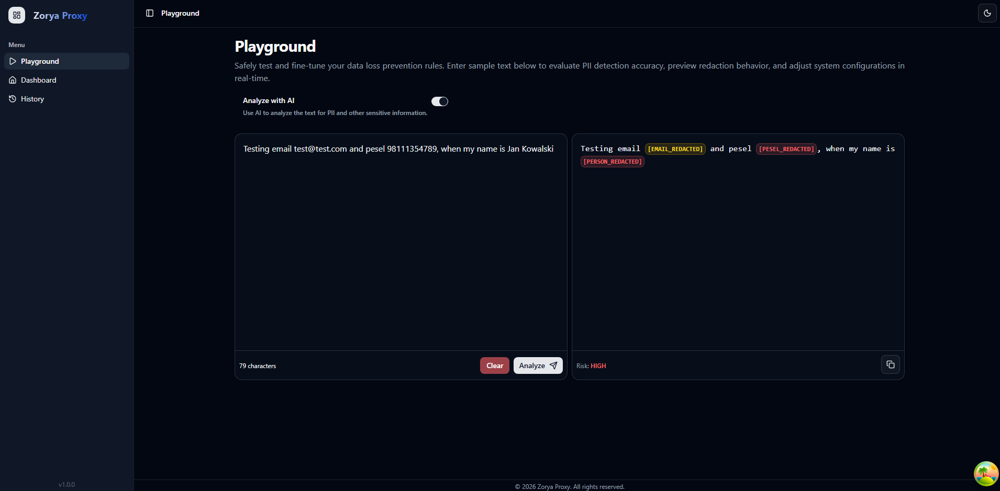
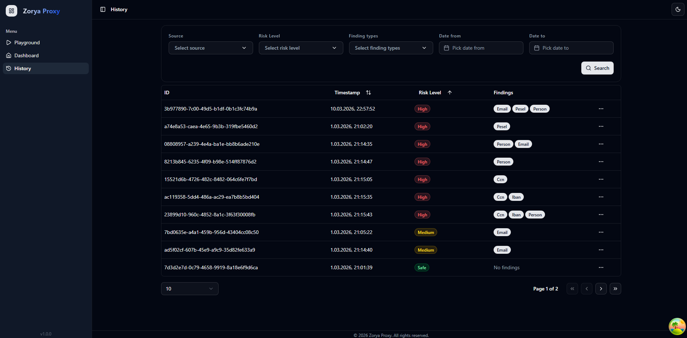
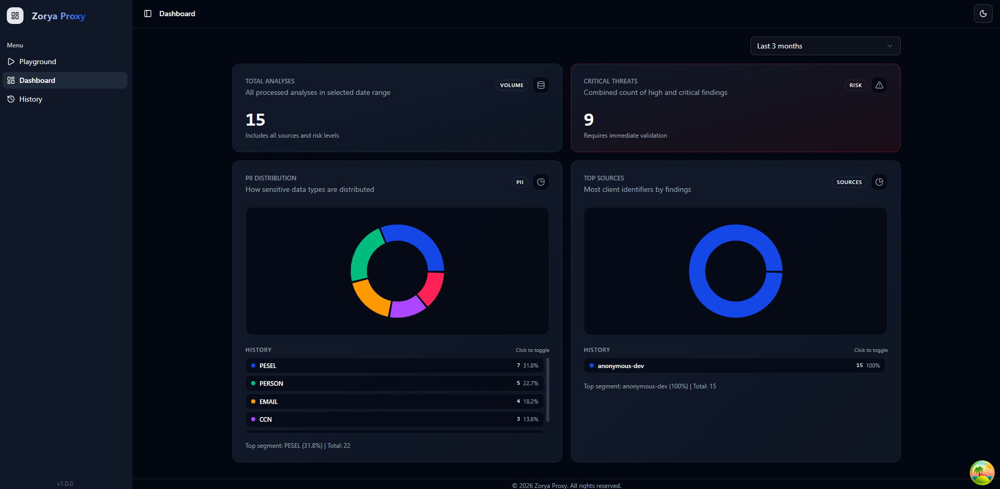
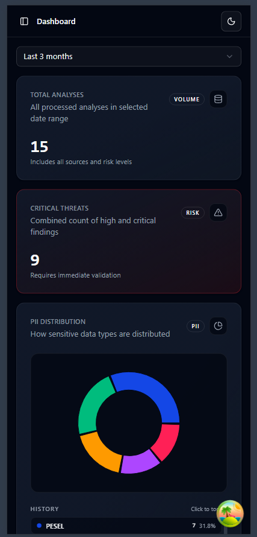
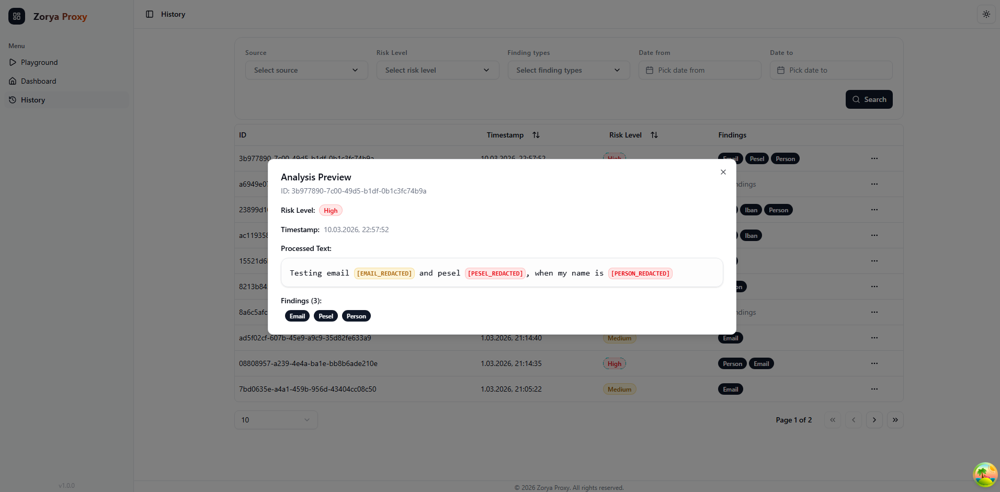

<h1 align="center">Zorya Proxy</h1>

<p align="center">
  <strong>Enterprise AI Security Gateway protecting data privacy & optimizing costs</strong>
</p>

<p align="center">
  <a href="#features">Features</a> •
  <a href="#architecture">Architecture</a> •
  <a href="#ui">UI</a> •
  <a href="#getting-started">Getting Started</a> •
  <a href="#api-reference">API Reference</a> •
  <a href="#configuration">Configuration</a> •
  <a href="#testing">Testing</a> •
  <a href="#license">License</a>
</p>

<p align="center">
  
  
  
</p>

---

## Overview

**Zorya Proxy** is an enterprise-grade AI security gateway designed to protect sensitive data in transit to AI/LLM services. It automatically detects and masks Personally Identifiable Information (PII) before data leaves your infrastructure, helping organizations maintain compliance while leveraging AI capabilities.

Named after the Slavic goddess Zorya who guards the universe, this proxy stands as your first line of defense in AI data privacy.

## Features

### Intelligent PII Detection

- **Hybrid Detection Pipeline** - Combines fast regex-based pattern matching with AI-powered semantic analysis for comprehensive coverage
- **Local-Only Execution** – Powered by Ollama; all PII detection is performed locally to ensure maximum data sovereignty and compliance
- **Multiple PII Types Supported:**
  - Email addresses
  - National IDs (PESEL)
  - Phone numbers
  - IBAN bank account numbers
  - Credit card numbers (CCN) with Luhn validation
  - Person names
  - Medical information
  - Addresses
  - Offensive content

### Smart Data Masking

- Automatic redaction with type-specific placeholders (`[EMAIL_REDACTED]`, `[CCN_REDACTED]`, etc.)
- Length-preserved masking for AI analysis
- Original position tracking for audit trails

### Risk Assessment

- Five-tier risk classification: **SAFE**, **LOW**, **MEDIUM**, **HIGH**, **CRITICAL**
- Aggregate risk scoring across all findings
- Real-time threat monitoring

### Modern Dashboard

- Intuitive web interface for testing and monitoring
- Interactive playground for rule testing
- Analysis history with filtering capabilities
- Dashboard with analytics and metrics

### AI-Enhanced Analysis

- Optional AI-powered semantic analysis using Ollama
- Catches context-dependent PII that regex might miss
- Configurable per-request

## Architecture

```
zorya/
├── backend/                    # Java Spring Boot API
│   └── zorya-platform/
│       ├── zorya-api/          # REST controllers & services
│       ├── zorya-core/         # Domain logic & PII processors
│       └── zorya-infra/        # Database & AI integrations
│
└── frontend/                   # React TypeScript dashboard
    └── src/
        ├── components/         # Reusable UI components
        ├── features/           # Feature-based modules
        ├── pages/              # Page components
        ├── types/              # TypeScript definitions & Interfaces
        └── lib/                # Utilities & API client

```

### Tech Stack

**Backend:**
- Java
- Spring Boot
- Spring Data JPA
- Spring AI
- Ollama
- PostgreSQL

**Frontend:**
- React 19 
- TypeScript
- TailwindCSS
- TanStack Query
- Shadcn
- Biome

**Infrastructure**
- Docker


## UI

### Playground

Real-time text analysis environment with side-by-side redaction preview, visual finding badges, and a toggle for semantic AI scanning.




### History

Advanced data table for browsing past scans, featuring dynamic multi-criteria filtering (Source, Risk Level, Finding Types, Date Range) and pagination.



### Dashboard

Comprehensive analytics overview providing real-time insights into security trends and data exposure across your organization.
- **Key Metrics** – Instant visibility into total analysis volume and the count of critical threats requiring immediate validation.
- **PII Distribution** – Interactive donut chart visualizing the most frequent types of sensitive data detected (e.g., PESEL, Person, Email, CCN).
- **Top Sources** – Identification of the most active client identifiers or API consumers generating findings.
- **Time-based Filtering** – Flexible data ranges (e.g., Last 24 hours, Last 30 days, Last 3 months) for trend analysis.




### Theme Support

Fully responsive layout with built-in Light and Dark mode toggle.



## Getting Started

### Prerequisites

- **Java 17+** (for backend)
- **Node.js 18+** (for frontend)
- **npm** or **yarn**
- **Ollama** (optional, for AI-enhanced analysis)


### Backend Setup

1. Navigate to the backend directory:
   ```bash
   cd backend/zorya-platform
   ```

2. Run Docker image
   ```bash
   docker-compose up
   ```

3. Build and run the application:
   ```bash
   mvn spring-boot:run -pl zorya-api
   ```

   The API will be available at `http://localhost:8080`

### Frontend Setup

1. Navigate to the frontend directory:
   ```bash
   cd frontend
   ```

2. Install dependencies:
   ```bash
   npm install
   ```

3. Start the development server:
   ```bash
   npm run dev
   ```

   The dashboard will be available at `http://localhost:5173`

### Quick Test

Once both services are running, you can test the analysis endpoint:

```bash
curl -X POST http://localhost:8080/api/v1/analyze \
  -H "Content-Type: application/json" \
  -d '{
    "text": "Contact John at john.doe@example.com or call 555-123-4567",
    "config": { "useAi": false, "activeModules": [] },
    "source": "API"
  }'
```

## API Reference

### Analyze Text

Detect and mask PII in text content.

```http
POST /api/v1/analyze
```

**Request Body:**
```json
{
  "text": "string",
  "config": {
    "useAi": boolean,
    "activeModules": []
  },
  "source": "API | PLAYGROUND",
  "clientIdentifier": "string (optional)"
}
```

**Response:**
```json
{
  "analysisId": "uuid",
  "processedText": "Contact [PERSON_REDACTED] at [EMAIL_REDACTED]...",
  "riskLevel": "SAFE | LOW | MEDIUM | HIGH | CRITICAL",
  "timestamp": "ISO-8601 datetime",
  "findings": [
    {
      "type": "EMAIL | PESEL | PHONE | IBAN | CCN | PERSON | MEDICAL | ADDRESS | OFFENSIVE",
      "value": "Partial value",
      "startIndex": integer,
      "endIndex": integer,
      "risk": "SAFE | LOW | MEDIUM | HIGH | CRITICAL"
    }
  ]
}
```

### Get Analysis History

Retrieve past analysis records with filtering.

```http
GET /api/v1/history
```

**Query Parameters:**
| Parameter | Type | Description |
|-----------|------|-------------|
| `sources` | string[] | Filter by source (`API`, `PLAYGROUND`) |
| `riskLevels` | string[] | Filter by risk level |
| `piiTypes` | string[] | Filter by PII entity types |
| `startDate` | ISO-8601 | Start of date range |
| `endDate` | ISO-8601 | End of date range |
| `page` | int | Page number (default: 0) |
| `size` | int | Page size (default: 20) |

### Dashboard Summary

Get aggregated metrics and statistics.

```http
GET /api/v1/dashboard/summary
```

**Query Parameters:**
| Parameter | Type | Description |
|-----------|------|-------------|
| `startDate` | ISO-8601 | Start of date range |
| `endDate` | ISO-8601 | End of date range |

**Response:**
```json
{
  "totalAnalyses": integer,
  "criticalThreats": integer,
  "piiDistribution": [
    {
      "type": "EMAIL | PESEL | PHONE | IBAN | CCN | PERSON | MEDICAL | ADDRESS | OFFENSIVE",
      "count": integer 
    },
  ],
  "topSources": [
    { "clientIdentifier": "string", "count": integer }
  ]
}
```

## Configuration

### Environment Variables (.env)
```env
POSTGRES_DB=zorya_db
POSTGRES_USER=zorya_user
POSTGRES_PASSWORD=zorya_password
POSTGRES_HOST=localhost
POSTGRES_PORT=5432
```


### AI Analysis

To enable AI-enhanced PII detection:

1. Install and run [Ollama](https://ollama.ai)
2. Pull a compatible model (e.g., `ollama pull qwen2:7b-instruct`)
3. Set `useAi: true` in your analysis requests


## Testing

### Backend tests:

```bash
cd backend/zorya-platform
mvn test
```


## License

This project is licensed under the MIT License - see the [LICENSE](LICENSE) file for details.

```
MIT License

Copyright (c) 2025 zorya-proxy

Permission is hereby granted, free of charge, to any person obtaining a copy
of this software and associated documentation files (the "Software"), to deal
in the Software without restriction, including without limitation the rights
to use, copy, modify, merge, publish, distribute, sublicense, and/or sell
copies of the Software, and to permit persons to whom the Software is
furnished to do so, subject to the following conditions:

The above copyright notice and this permission notice shall be included in all
copies or substantial portions of the Software.

THE SOFTWARE IS PROVIDED "AS IS", WITHOUT WARRANTY OF ANY KIND, EXPRESS OR
IMPLIED, INCLUDING BUT NOT LIMITED TO THE WARRANTIES OF MERCHANTABILITY,
FITNESS FOR A PARTICULAR PURPOSE AND NONINFRINGEMENT.
```


